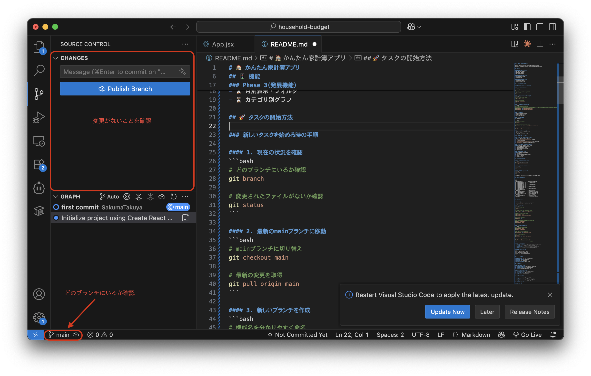
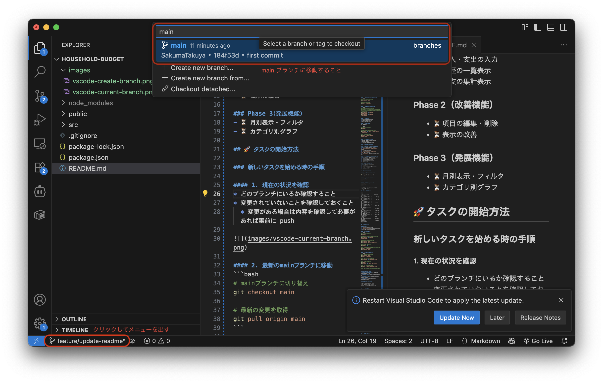
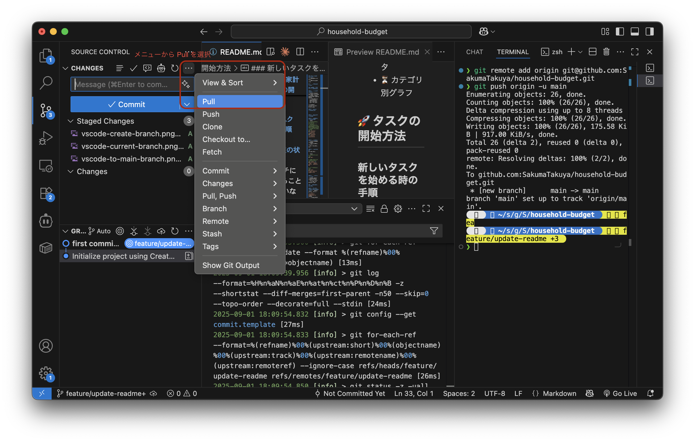
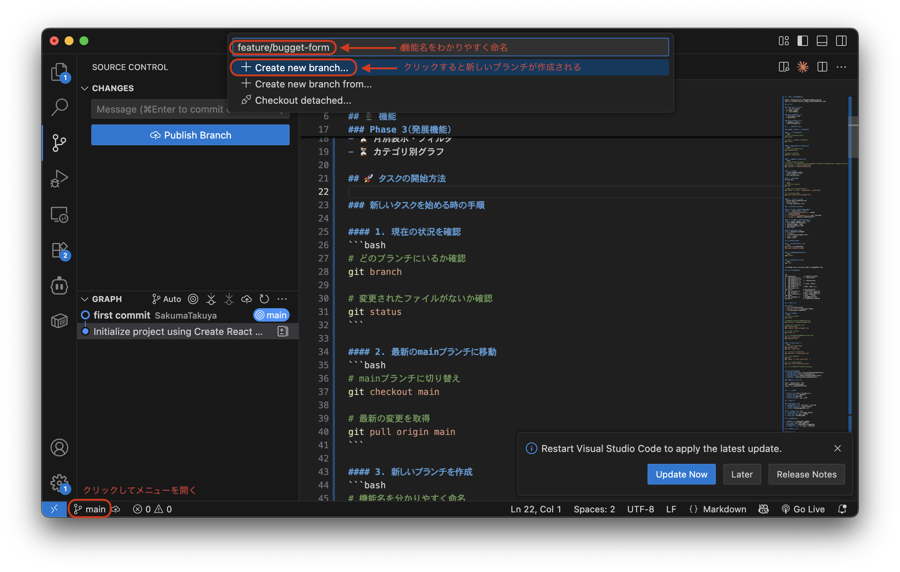
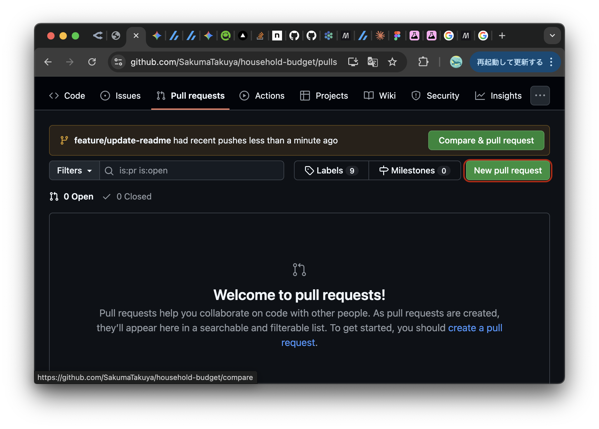
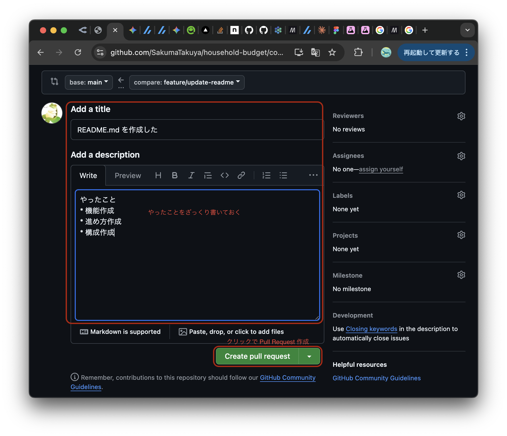

# 🏠 かんたん家計簿アプリ

日々の収支を簡単に記録・管理できるWebアプリです。  
React.js の学習を兼ねて、二人で協力して開発しています。

## 📱 機能

### Phase 1（基本機能）
- ✅ 収入・支出の入力
- ✅ 履歴の一覧表示
- ✅ 収支の集計表示

### Phase 2（改善機能）
- ⏳ 項目の編集・削除
- ⏳ 表示の改善

### Phase 3（発展機能）
- ⏳ 月別表示・フィルタ
- ⏳ カテゴリ別グラフ
- ⏳ カテゴリの新規作成

## 🚀 作業の流れ

### 1. 現在の状況を確認
- どのブランチにいるか確認すること
- 変更されていないことを確認しておくこと
  - 変更がある場合は内容を確認して必要があれば事前に push



### 2. mainブランチに移動
- ブランチをクリックして main に移動すること



### 3. 最新の状態を取得
- main を最新にしておくこと



### 4. 新しいブランチを作成
- 機能名をわかりやすく命名すること
  - feataure: 機能という意味なので、新しい機能を開発するときはこの名前をつけると良い



### 5. 作業開始
- 該当するファイルを開く
- 小さな変更から始める
- こまめに保存・確認

### 6. Pull Request ページに移動
- https://github.com/SakumaTakuya/household-budget/pulls に移動



### 7. Pull Request 作成
- compare: が自分の作成したブランチであるか確認すること


### 8. Pull Request 詳細記入
- わかりやすく完結にまとめること
- AI に考えてもらっても良い



## セットアップ手順

### 1. リポジトリのクローン
```bash
git clone git@github.com:SakumaTakuya/household-budget.git
cd household-budget
```

### 2. 依存関係のインストール
```bash
npm install
```

### 3. 開発サーバーの起動 (動作確認)
```bash
npm start
```

ブラウザで http://localhost:3000 が自動で開きます。

## 📁 プロジェクト構造

```
src/
├── components/
│   ├── BudgetForm.jsx   ← まずここから
│   └── BudgetForm.css   ← 見た目を整える
├── App.jsx              ← BudgetFormを呼び出す
└── App.css              ← 全体レイアウト
```

## 🎯 開発ルール

### Git運用
- `main`ブランチ：安定版
- `feature/機能名`ブランチ：新機能開発
- 機能完成後にプルリクエスト

> [!NOTE]
> #### なぜブランチを分けるのか？
> 
> **🛡️ 安全性の確保**
> - `main`ブランチを常に「動く状態」に保つ
> - 実験的な変更で全体を壊すリスクを回避
> - 問題があっても`main`に戻れば安心
> 
> **👥 協力開発をスムーズに**
> ```
> あなた：feature/budget-form で入力フォーム作成中
> 相手　：feature/item-list で履歴表示作成中
> 　　　　↓
> 　　 お互い邪魔せずに並行開発可能
> 　　　　↓
> 　　完成したものを順番にmainに統合
> ```
> 
> **📝 変更履歴の整理**
> - 「この機能はいつ、誰が、なぜ追加したか」が明確
> - 問題が起きた時に原因を特定しやすい
> - 機能ごとに変更をまとめられる
> 
> **🔄 実際の例**
> ```
> main: 基本の家計簿アプリ（動作する状態）
>  ├─ feature/budget-form: フォーム改善中（作業中）
>  ├─ feature/delete-item: 削除機能開発中（作業中）
>  └─ feature/date-filter: 日付検索機能（完成→mainに統合）
> ```


### コーディング規約
- **コンポーネント名**: PascalCase（例：BudgetForm）
- **ファイル名**: コンポーネント名と同じ
- **CSS クラス名**: コンポーネント名と同じ
- **関数名**: camelCase（例：addBudgetItem）

## 🛠️ 使用技術

- **React.js** (18.x): UIライブラリ
- **Lucide React**: アイコン
- **CSS**: スタイリング
- **localStorage**: データ保存

## 🎨 デザイン方針

- **シンプル**: 余計な装飾は避ける
- **直感的**: 迷わず操作できるUI
- **見やすい**: 収入は青、支出は赤で区別
- **モバイル対応**: スマホでも使いやすく

## 🤝 開発の進め方

1. **要件確認**: 何を作るか明確にする
2. **タスク分割**: 小さな単位に分ける
3. **ペアプログラミング**: 一緒に画面を見ながら開発
4. **コードレビュー**: お互いのコードを確認
5. **テスト**: 実際に使ってみて改善点を見つける

## 🆘 困った時は

### よくあるトラブル
- **エラーが出たら**: ブラウザのConsole（F12）を確認
- **画面が真っ白**: `npm start` でサーバーが起動しているか確認
- **変更が反映されない**: ファイル保存後、ブラウザをリロード

### Git関連のトラブル
- **ブランチが分からない**: VS Code の左下で確認
- **マージコンフリクト**: 焦らず相談する
- **間違えてコミット**: 一緒に対処